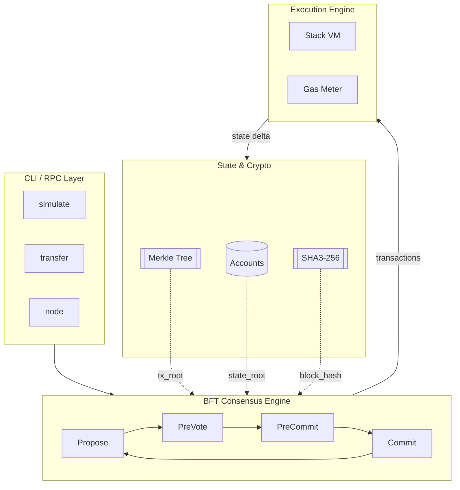
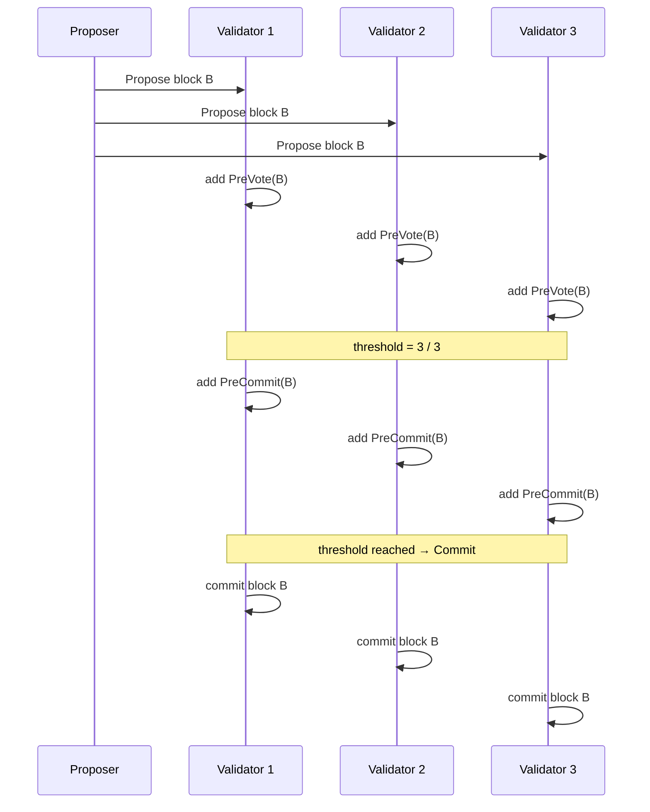
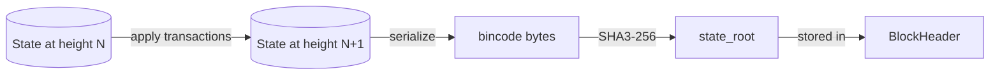
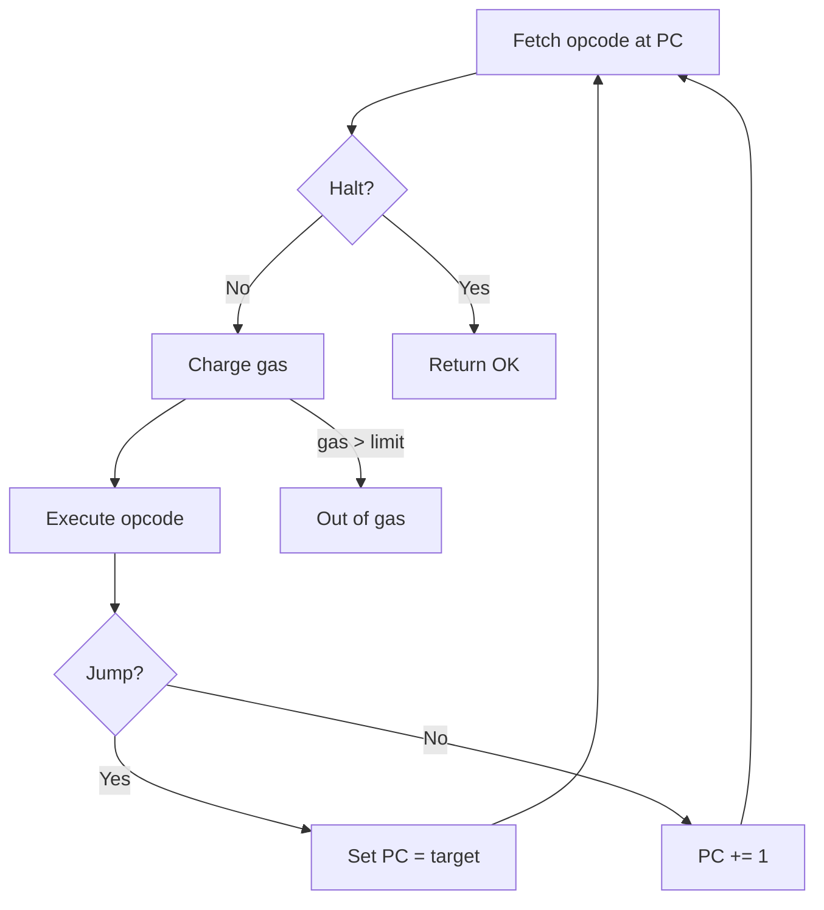
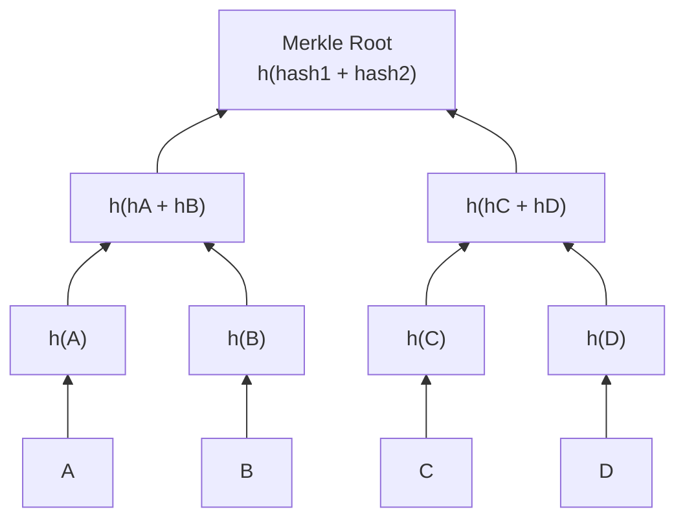
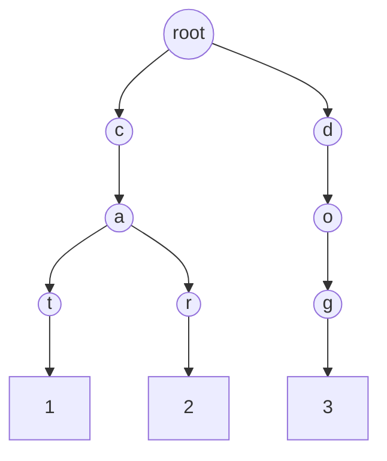
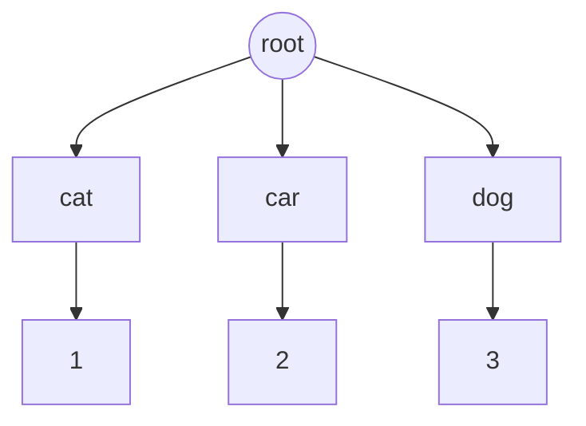
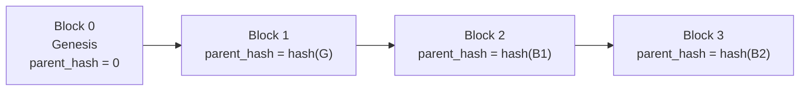

# TinyL1 — A Minimal Layer 1 Blockchain in Rust

A from-scratch L1 blockchain implementing:

- **Account-based state** with nonce replay protection
- **Merkle tree** for transaction roots and state commitment
- **Stack-based VM** with 16 opcodes and gas metering
- **BFT consensus** (Tendermint-style: Propose → PreVote → PreCommit → Commit)
- **Deterministic CLI simulator** for local testing

## Architecture



## Consensus Flow



## State Transition



## VM Execution Loop



## Project Layout

```text
rust-blockchain/
├── tiny_l1/
│   ├── src/
│   │   ├── main.rs        # CLI entry point
│   │   ├── lib.rs         # Public API re-exports
│   │   ├── account.rs     # Account struct
│   │   ├── block.rs       # Block + BlockHeader
│   │   ├── consensus.rs   # BFT consensus engine
│   │   ├── merkle.rs      # Merkle tree
│   │   ├── prelude.rs     # Shared imports
│   │   ├── state.rs       # Account state + apply()
│   │   ├── transaction.rs # Transaction
│   │   ├── utils.rs       # current_timestamp()
│   │   └── vm.rs          # Stack VM
│   └── tests/
│       ├── account_transactions_test.rs
│       ├── block_with_five_transactions.rs
│       ├── consensus_test.rs
│       └── test_fibonacci_contract.rs
└── README.md
```

## Quick Start

```bash
# Run the deterministic consensus simulator
cargo run -- simulate

# Run the transfer simulator with live balance updates
RUST_LOG=info cargo run -- transfer --blocks 3 --transfers-per-block 5

# Print the genesis block
cargo run -- genesis

# Generate a dummy account address
cargo run -- account
```

## What is a Merkle Tree?

A **Merkle tree** is a way to take many pieces of data and compress them into a single fixed-size hash, called the **root hash**. If any piece of data changes, the root hash changes too, which makes it easy to detect tampering.

### How it works

1. Take each item and hash it. These hashes become the **leaves** of the tree.
2. Pair adjacent leaves and hash them together. This produces the next level.
3. Keep pairing and hashing until only one hash remains — the **Merkle root**.



### Why blockchains use it

- **Integrity**: changing one transaction changes the root, so the block hash changes too.
- **Efficient verification**: to prove that transaction `C` is in the block, you only need to provide the sibling hashes `hD` and `hash1` — not the whole block. This is called a **Merkle proof**.
- **Fixed-size commitment**: a block with 1,000 transactions still has one 32-byte root.

### In TinyL1

- `tx_root` in [`BlockHeader`](tiny_l1/src/block.rs) is the Merkle root of the block's transactions.
- `state_root` is the hash of the account map (a different commitment, but the same idea of summarizing state).

## What is a Patricia Trie?

A **Patricia trie** (also called a **radix trie** or **prefix tree**) is a data structure for storing key-value pairs where keys are strings or sequences of bits. It collapses long chains of nodes that have only one child, making lookups efficient.

### How it works

Imagine storing these keys and values:

```text
cat  -> 1
car  -> 2
dog  -> 3
```

A normal trie branches on every character:



A Patricia trie compresses single-child paths:



### Key properties

| Property | Meaning |
|----------|---------|
| Prefix sharing | Keys with common prefixes share path |
| O(key length) lookup | Follow bits/characters from root |
| Compact | Single-child chains are collapsed |
| Deterministic | Same keys always produce same structure |

### In blockchains

A **Merkle-Patricia trie** combines both ideas:
- Patricia trie organizes accounts by address.
- Merkle hashing replaces plain pointers with hashes.
- The root hash commits to the entire state.

This gives **efficient lookups** and **cryptographic verifiability** at the same time.

### In TinyL1

Your current `state_root` in [`src/state.rs`](tiny_l1/src/state.rs) is just a hash of the serialized account map. It is not a Merkle-Patricia trie yet. To build a real one, you would:
1. Split each 20-byte address into a path of nibbles (half-bytes).
2. Store accounts at the leaves.
3. Hash each level bottom-up to produce the state root.
4. Use the trie for efficient balance proofs.

### Simple analogy

- A normal dictionary: look up by full key, one comparison.
- A trie: follow letters one by one.
- A Patricia trie: skip empty hallways.
- A Merkle-Patricia trie: also take a cryptographic fingerprint of every floor, so you can prove what was there.

## What is Consensus?

**Consensus** is the mechanism by which a distributed network of nodes agrees on the same state of the blockchain. Because no single node is in charge, the protocol must ensure that all honest participants commit the same blocks in the same order.

### Why it matters

In a decentralized system, transactions arrive at different nodes at different times. Consensus solves questions like:

- Which transactions belong in the next block?
- What order do blocks appear in?
- How do nodes agree when some participants are faulty or malicious?

### Common properties

| Property | Meaning |
|----------|---------|
| Safety | Honest nodes never commit conflicting blocks |
| Liveness | The network continues to make progress as long as enough nodes are online |
| Fault tolerance | The protocol can tolerate a bounded number of faulty or malicious nodes |
| Finality | Once a block is committed, it cannot be reversed |

### Byzantine Fault Tolerance (BFT)

A **Byzantine Fault Tolerant** consensus protocol can reach agreement even when some nodes behave arbitrarily — sending conflicting messages, lying, or crashing. The classic tolerance threshold is:

> A network of `N` validators can tolerate up to `f = (N - 1) / 3` Byzantine faults.

So for 4 validators, the system remains safe and live as long as no more than 1 is faulty.

### Tendermint-style rounds

TinyL1 uses a simple Tendermint-like round structure:

1. **Propose** — a leader broadcasts a candidate block.
2. **PreVote** — validators vote on whether they saw a valid proposal.
3. **PreCommit** — validators lock in their vote after seeing a quorum of prevotes.
4. **Commit** — once a quorum of precommits is reached, the block is finalized.

This two-phase voting design prevents validators from accidentally committing different blocks at the same height.

### In TinyL1

The consensus engine lives in [`src/consensus.rs`](tiny_l1/src/consensus.rs). It stores:

- `proposed_block`: the candidate block for the current round.
- `pre_votes`: votes collected during the PreVote phase.
- `pre_commits`: votes collected during the PreCommit phase.
- `threshold`: the minimum number of votes needed to advance.

The CLI can run a deterministic simulation:

```bash
RUST_LOG=info cargo run -- simulate --validators 4 --threshold 3 --blocks 5
```

## What is a Genesis Block?

A **genesis block** is the very first block in a blockchain. It has no parent, so its `parent_hash` is usually all zeros. Every node starts from the same genesis block, which makes the entire chain deterministic and verifiable from that point forward.

### Why it matters

- It is the **anchor** of the chain. Block 1 references the genesis block as its parent.
- It establishes the **initial state**: pre-funded accounts, validator set, or protocol parameters.
- It guarantees that all nodes begin from the **same agreed-upon history**.

### In TinyL1

The genesis block is created in [`src/block.rs`](tiny_l1/src/block.rs):

```rust
pub fn genesis(state: &State, timestamp: u64) -> Self {
    Block {
        header: BlockHeader {
            parent_hash: [0u8; 32],  // no parent
            state_root: state.root(),
            tx_root: [0u8; 32],      // no transactions yet
            height: 0,
            timestamp,
        },
        transactions: vec![],
    }
}
```

You can inspect it from the CLI:

```bash
cargo run -- genesis
```

The genesis block in TinyL1 has:
- `height = 0`
- `parent_hash = 0x0000...0000`
- `tx_root = 0x0000...0000`
- a `state_root` derived from the accounts passed in (often empty at genesis)

### Genesis to chain



### Analogy

If the blockchain is a book, the genesis block is page one. You cannot remove it without rewriting the entire book, because every later page references the one before it.

## Running Tests

```bash
cargo test
```

This runs unit tests, integration tests, and the VM Fibonacci contract test. 